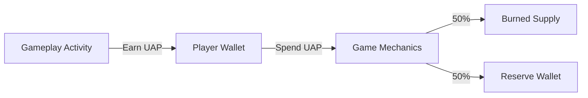

import { PieChart, Pie, Tooltip, ResponsiveContainer } from "recharts";

## Overview

Super Galactic operates on a closed-loop, gameplay-driven economy powered by the **UAP token**.

UAP is designed as an in-game utility asset, earned through active participation and spent on core progression systems such as upgrades and breeding. The economy is structured to encourage meaningful engagement while controlling token velocity and preventing uncontrolled inflation over time.

By tying UAP flow directly to gameplay actions, Super Galactic maintains a balanced progression model that rewards activity without relying on passive or idle mechanics.

## UAP Issuance

UAP enters circulation exclusively through gameplay.

- Earned via PvE missions and in-game activities
- Subject to daily earning limits to prevent inflation
- Not generated through passive, idle, or automated systems

This approach ensures that UAP distribution remains closely aligned with player activity and progression, while protecting the game economy from excessive inflation as participation scales.

## UAP Utility

UAP is required for key in-game actions, including but not limited to:

- Asset and character upgrades
- Breeding mechanics
- Gameplay progression and enhancement systems

These utility sinks scale alongside player advancement, creating ongoing demand for UAP as players progress through the game.

## Burn and Reserve Mechanism

All UAP spent in-game follows a fixed allocation model:

- **50% is permanently burned**, reducing circulating supply
- **50% is allocated to a reserve wallet**

The reserve wallet is used to support the broader ecosystem and may be applied toward:

- Gameplay reward balancing
- Liquidity support
- Supply management actions, including potential buybacks

Reserve usage is discretionary and determined based on ecosystem needs rather than predefined outcomes.

## Reserve Transparency

The reserve wallet is managed on-chain.\
Wallet addresses will be made publicly available to provide transparency into reserve movements and usage.

## Economic Design Principles

The Super Galactic economy is built around the following principles:

- Activity-based issuance, not passive accumulation
- Predictable utility-driven sinks
- Controlled token velocity through configurable limits
- Deflationary pressure via consistent token burns
- Flexible reserve management to support ecosystem health

## Economy Flow

