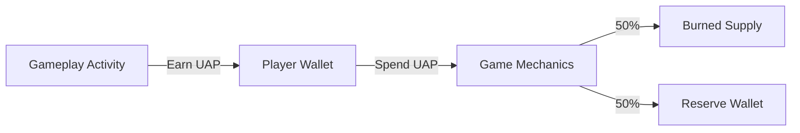

## Overview

Super Galactic operates on a closed-loop, gameplay-driven economy powered by the **UAP token**.  

UAP functions as an in-game utility asset, earned through active participation and spent on core progression systems.

The economy is designed to reward engagement, regulate token flow, and support long-term gameplay sustainability without relying on uncontrolled emissions or passive mechanics.

---

## UAP Issuance

UAP enters circulation exclusively through gameplay.

- Earned via PvE missions and in-game activities  

- Subject to daily activity limits to manage token flow  

- Issuance is tied to player participation rather than idle or passive systems  

This structure ensures UAP is distributed based on gameplay contribution and progression.

---

## UAP Utility

UAP is required for key in-game actions, including but not limited to:

- Asset and character upgrades  

- Breeding mechanics  

- Gameplay progression and enhancement systems  

These utility sinks scale alongside player advancement, creating ongoing demand for UAP as players progress through the game.

---

## Burn and Reserve Mechanism

All UAP spent in-game follows a fixed allocation model:

- **50% is permanently burned**, reducing circulating supply  

- **50% is allocated to a reserve wallet**

The reserve wallet is used to support the broader ecosystem and may be applied toward:

- Gameplay reward balancing  

- Liquidity support  

- Supply management actions, including potential buybacks  

Reserve usage is discretionary and determined based on ecosystem needs rather than predefined outcomes.

---

## Reserve Transparency

The reserve wallet is managed on-chain.  

Wallet addresses will be made publicly available to provide transparency into reserve movements and usage.

---

## Economic Design Principles

The Super Galactic economy is built around the following principles:

- Activity-based issuance, not passive accumulation  

- Predictable utility-driven sinks  

- Controlled token velocity through configurable limits  

- Deflationary pressure via consistent token burns  

- Flexible reserve management to support ecosystem health  

Together, these elements form a sustainable and transparent game economy aligned with long-term player engagement.

---

## Economy Flow

import { PieChart, Pie, Tooltip, ResponsiveContainer } from "recharts";

const allocationData = [
  { name: "Burned", value: 50 },
  { name: "Reserve", value: 50 }
];

<ResponsiveContainer width="100%" height={300}>
  <PieChart>
    <Pie
      data={allocationData}
      dataKey="value"
      nameKey="name"
      outerRadius={100}
      label
    />
    <Tooltip />
  </PieChart>
</ResponsiveContainer>